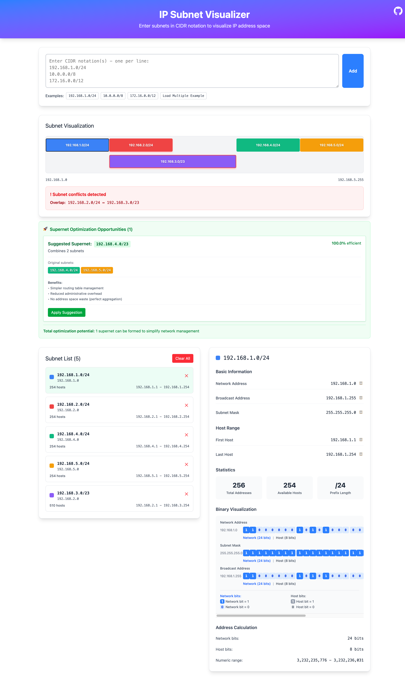

# IP Subnet Visualizer

A web-based tool for visualizing and managing IP subnet ranges. This tool helps network administrators and engineers efficiently design and understand subnet configurations through interactive visual representations.



## Features

### Core Functionality
- **Subnet Input**: Add multiple subnets using CIDR notation (e.g., 192.168.1.0/24)
- **Visual Representation**: Graphical display of subnet ranges and their relationships
- **Conflict Detection**: Highlight overlapping and conflicting subnets
- **Subnet Details**: View network address, broadcast address, available hosts, and subnet masks
- **Unused Range Detection**: Identify gaps in IP address space allocation
- **Supernet Suggestions**: Get recommendations for optimizing subnet design

### User Interface
- Responsive design for desktop and tablet devices
- Real-time calculations and visual updates
- Intuitive subnet management with add/remove functionality
- Color-coded subnet visualization for easy identification

## Getting Started

### Prerequisites
- Node.js (version 18 or higher)
- pnpm package manager

### Installation

1. Clone the repository:
```bash
git clone <repository-url>
cd ip-subnet-visualizer
```

2. Install dependencies:
```bash
pnpm install
```

3. Start the development server:
```bash
pnpm run dev
```

## License

This project is licensed under the MIT License - see the [LICENSE](LICENSE) file for details.
